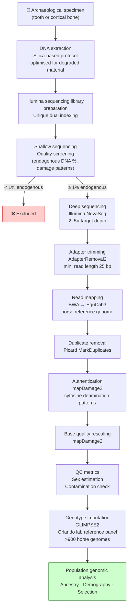

# Figures and Pipeline Notes

---

## Figure 1 — aDNA Processing Pipeline

The flowchart below describes the full bioinformatic pipeline from raw sequencing reads to population-ready genomes. This can be included in Section 1.3 of both the MSCA and Rannís applications.

---

## Figure 2 — Suggested Figures for the Proposals

The following figures are recommended for inclusion. None require specialist software — all can be made in PowerPoint, Illustrator, or similar tools.

---

### Figure A — Map of Iceland: Sampling sites

**What it shows**: A map of Iceland with sampling site locations marked, colour-coded by time period (settlement era / medieval / post-medieval / undated). Key sites labelled.

**Why it works**: Immediately conveys the geographic coverage of the study and the richness of the sample set. Evaluators who are not archaeologists can see at a glance that samples are distributed across the whole island.

**Data available**: Site names and approximate locations are in `background/sample_inventory/Horses.docx` and `summary_sites_120625.docx`.

---

### Figure B — Temporal transect schematic

**What it shows**: A horizontal timeline from 870 CE to ~1900 CE, with bars or dots indicating when sampled individuals lived. Key historical events marked: Norse settlement (~870 CE), livestock import ban (~982 CE), Black Death (~1402 CE), volcanic famines (Laki 1783), modern period.

**Why it works**: Shows the temporal depth of the study and explains why it captures meaningful demographic change. Connects the genomic data to Icelandic history.

---

### Figure C — Study design / Three Aims schematic

**What it shows**: A simple three-column or three-box diagram showing the three objectives:
- Obj. 1: Origins (Norse settlement → founding stock)
- Obj. 2: Demography (1,100 years of isolation → inbreeding, drift)
- Obj. 3: Adaptation (selection, gaits, disease resistance)

Each objective has 2–3 bullet points and an icon. Arrows from "Ancient genomes" feed into all three.

**Why it works**: Evaluators can see the scientific structure at a glance before reading the text.

---

### Figure D — Global horse genomics context map

**What it shows**: A world map (or Eurasia-centred map) showing where previous ancient horse genomic studies have been conducted (Pontic steppe, Central Asia, Iberian Peninsula, Scandinavia, etc.) with Iceland highlighted as the obvious gap in the North Atlantic.

**Why it works**: Powerfully visualises the geographic gap this project fills. This is one of the most persuasive things you can put in front of an evaluator.

---

### Figure E — Knowledge transfer diagram (MSCA-specific)

**What it shows**: A simple two-way arrow diagram between Sunna/University of Iceland and CEH/Copenhagen:
- Sunna brings → Icelandic aDNA protocols, specimen access, human pop genomics expertise
- CEH provides → animal population genomics, computing, lab infrastructure, international network
- Orlando (Toulouse) feeds in → horse imputation panel, horse genomics expertise

**Why it works**: MSCA evaluators are specifically looking for genuine bidirectional knowledge transfer. This makes it explicit.

---

## Notes on Adapting the Pipeline Script for Horses

The existing script (`aDNAfastqMAPpe.sh`) is almost entirely species-agnostic. The steps — adapter trimming, BWA mapping, deduplication, mapDamage — are identical for horse aDNA. Only the configuration files need updating:

| What to change | Human version | Horse version |
|---|---|---|
| Reference genome (`refFa`) | GRCh38 / hg38 | EquCab3 (horse reference genome) |
| `fileSourceFile` | `aDNApipe_decode_humanB38_source.sh` | New horse-specific source file pointing to EquCab3 |
| Sex chromosome names | `chrX`, `chrY` (human) | Verify EquCab3 naming (likely `chrX`, `chrY`) |
| Contamination (`angsd ContamX`) | Human X-chromosome SNP files | Horse equivalent or remove — less standard for horses |
| SNP capture coverage (`SNPset1240k`) | Human 1240K panel | Replace with horse SNP panel coverage or remove |
| mtDNA pipeline | Human mtDNA reference | Horse mtDNA reference (GenBank accession X79547.1 or similar) |

In practice, creating a new `fileSourceFile` pointing to EquCab3 and removing or adapting the human-specific contamination step is all that is needed. The rest of the script runs unchanged.

[Claude comment: Do you have an EquCab3 reference genome already available at deCODE or CEH? And do you want me to draft a horse-specific `fileSourceFile` to go alongside the existing script? That would be a very small file — just paths and genome parameters.]
