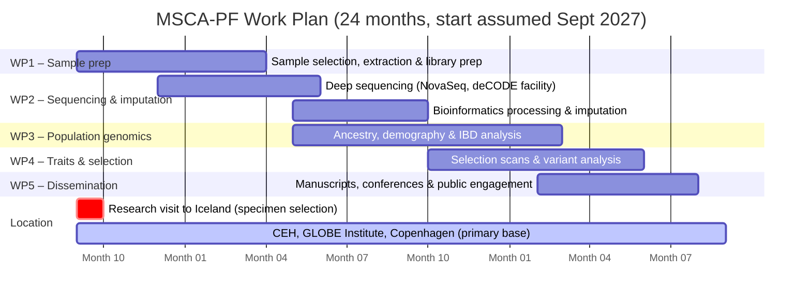

# Part B-1 — Section 3: Implementation

*First draft — preliminary. To be revised after review by Sunna and Hannes.*
*Target length: ~3 pages in final formatted document.*

---

## 3.1 Work Plan

The project runs for **24 months** and is based throughout at the Centre for Evolutionary Hologenomics (CEH), GLOBE Institute, University of Copenhagen. All aDNA laboratory work will be conducted at CEH, using specimens transported from the National Museum of Iceland. A single research visit to Iceland (Month 1) will be made for specimen assessment and selection at the National Museum; all subsequent work takes place in Copenhagen.

### Work Packages

**WP1 — Sample selection, extraction, and library preparation** (Months 1–7)

The project opens with a research visit to the National Museum of Iceland (Month 1), during which Sunna will assess available bone and tooth material, select the optimal specimens for aDNA work, and arrange transport of selected specimens to CEH, Copenhagen. Drawing on the existing permission for 22 settlement-era specimens and the pending expanded permission covering up to 90 specimens, up to 90 samples will be selected. Seven existing sequencing libraries (VHR031, VHR085, VHR089, VHR093, VHR100, VHR102, VHR105) will also be assessed and incorporated. Following specimen arrival at CEH, DNA extraction and library preparation will be carried out at the CEH aDNA laboratory (Months 2–7). Initial shallow sequencing will be used to screen all libraries for endogenous DNA content before committing samples to deep sequencing.

*Milestone M1.1* (Month 3): At least 30 libraries prepared and quality-assessed.
*Milestone M1.2* (Month 7): All libraries prepared; samples selected for deep sequencing.

**WP2 — Sequencing, bioinformatic processing, and imputation** (Months 4–14)

Deep sequencing will be performed on the Illumina NovaSeq platform (Months 4–10), using sequencing infrastructure available at CEH or via external sequencing services. Bioinformatic processing — adapter trimming, mapping to EquCab3, deduplication, mapDamage rescaling — will run in parallel with sequencing on CEH's computational infrastructure. Samples meeting the quality threshold (>1% endogenous, characteristic damage patterns) will be imputed using GLIMPSE2 and the Orlando laboratory reference panel (Months 10–14). This WP will involve close coordination with the Orlando laboratory (CAGT, Toulouse).

*Milestone M2.1* (Month 10): At least 50 mapped and quality-filtered genomes available.
*Milestone M2.2* (Month 14): Full imputed dataset assembled; ready for population genomic analysis.

**WP3 — Population structure and ancestry analysis** (Months 10–20)

Using the imputed dataset, Sunna will carry out the analyses addressing Objectives 1 and 2: PCA, ADMIXTURE, f-statistics, admixture graph modelling, IBD analysis, ROH quantification, and demographic modelling. Results will be interpreted against the Orlando laboratory's global horse reference dataset. This WP will run partly in parallel with WP2, beginning as the first imputed genomes become available.

*Milestone M3.1* (Month 16): Preliminary ancestry and demographic results; internal seminar presentation at CEH.
*Milestone M3.2* (Month 20): Complete population genomic analysis; first manuscript drafted.

**WP4 — Selection scans and trait-associated variant analysis** (Months 14–22)

Genome-wide selection scans will identify signatures of adaptation specific to the Icelandic lineage. Targeted analysis of known functional variants (DMRT3, coat colour loci, metabolic and immune-related variants) will characterise the evolution of the breed's distinctive traits under isolation. This WP addresses Objective 3 and will draw on horse functional genomics expertise from the Orlando laboratory.

*Milestone M4.1* (Month 20): Selection scan results complete.
*Milestone M4.2* (Month 22): Second manuscript drafted.

**WP5 — Dissemination and communication** (Months 18–24)

Final manuscript preparation, conference presentations, public engagement activities, and data deposition. Both primary research articles are submitted to peer-reviewed journals. Genomic data are deposited in ENA; pipelines released on GitHub.

*Milestone M5.1* (Month 22): Both manuscripts submitted.
*Milestone M5.2* (Month 24): All data deposited; public engagement activities completed.

---

### Gantt Chart

---

## 3.2 Risk Assessment

| Risk | Likelihood | Impact | Mitigation |
|---|---|---|---|
| Low endogenous DNA yield from some specimens | Medium | Medium | Large initial sample pool (up to 90 specimens); 7 existing libraries already confirm that protocol works on this material; National Museum backup list provides additional candidates |
| Export permission for specimens not granted | Low | Medium | Strong precedent: the 22 Icelandic horse specimens analysed by Pálsdóttir et al. were exported to Norway under the same framework; Minjasafnanefnd application to be submitted in parallel with this application |
| Delayed access to remaining National Museum samples | Low | Medium | 22 specimens already permitted; expanded sampling proposal submitted in parallel; curator has indicated further permission is expected |
| Gilbert letter of support delayed | Low | High | Active ongoing collaboration; pre-existing relationship between applicant and CEH makes this unlikely |
| Imputation quality insufficient for low-coverage samples | Low | Medium | GLIMPSE2 has been validated for ancient horse genomes at 0.5–2× coverage using this reference panel; fallback: pseudohaploid calling for individuals with very low coverage |
| Sequencing capacity unavailable at CEH | Low | Low | Multiple options available: CEH sequencing infrastructure, external sequencing services, or deCODE Genetics facility under ongoing collaboration agreement |
| deCODE collaboration terms not fully finalised | Low | Low | All wet lab work and computing takes place at CEH; deCODE access is supplementary (existing libraries, sequencing backup); project is not dependent on finalisation of deCODE contract |

---

## 3.3 Resources

**Host institution infrastructure**

The Centre for Evolutionary Hologenomics (CEH), GLOBE Institute, University of Copenhagen provides:
- Ancient DNA laboratory facilities and reagents for extraction and library preparation
- High-performance computing infrastructure for large-scale population genomic analyses
- Deep expertise in population genomics of animals, directly relevant to the analytical objectives of this project
- A highly international research environment in ancient and environmental genomics

**External collaboration — Orlando laboratory (CAGT, Toulouse)**

Prof. Ludovic Orlando's laboratory at the Centre for Anthropobiology and Genomics of Toulouse contributes:
- The ancient horse imputation reference panel (>900 genomes) and all associated bioinformatic pipelines
- Expert scientific input on horse-specific population genomic analyses, selection scans, and trait variant interpretation
- Access to comparative ancient and modern horse datasets for global ancestry analyses

**Applicant's institutional resources**

Through an ongoing collaboration agreement with deCODE Genetics, Reykjavík, Dr Ebenesersdóttir retains access to:
- The dedicated aDNA clean-room laboratory at deCODE Genetics — a facility in which the applicant developed the aDNA protocols and remains the primary user
- Illumina sequencing infrastructure (NovaSeq, HiSeq, MiSeq)
- The deCODE biobank and population genomic databases for comparative analyses
- The National Museum of Iceland horse specimen collection

**Equipment and consumables**

Standard molecular biology consumables (extraction kits, library preparation reagents, sequencing reagents) will be budgeted within the MSCA fellowship grant. No major equipment purchases are required; all key instruments are already available at the host and partner institutions.

**Secondments and research visits**

One research visit to Iceland is planned and budgeted in Month 1 for specimen assessment and selection at the National Museum of Iceland, and transport arrangements for specimens to Copenhagen. No extended secondment in Iceland is required; all laboratory and analytical work is conducted at CEH.
